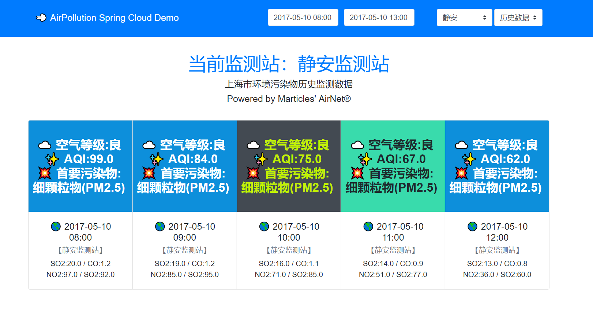
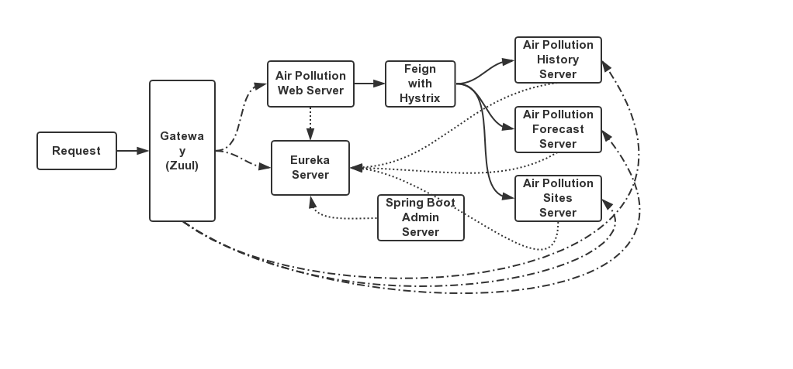
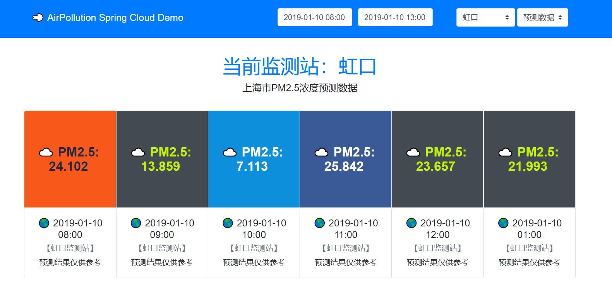
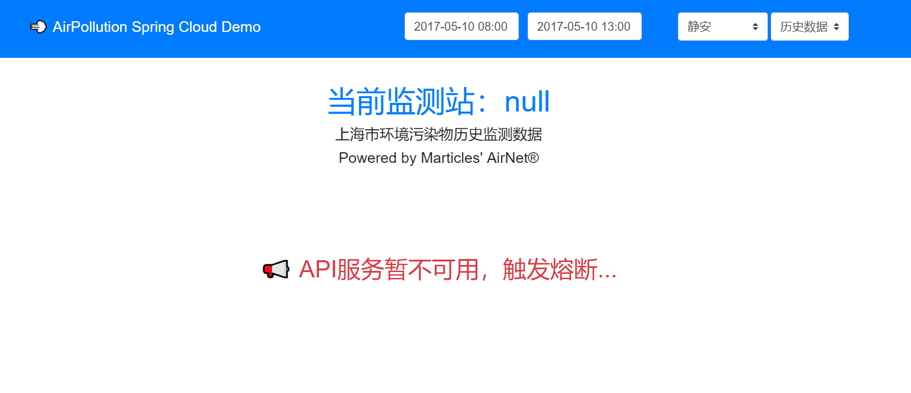

# air-pollution-microservices

基于 Spring Cloud 的历史空气污染物数据查询与PM2.5浓度预测数据查询 Demo，数据来自我的另一个项目 AirNet。

## 微服务架构

| 服务                                       | 端口 | 描述                       |
| :----------------------------------------- | :--- | :------------------------- |
| microservice-airpollution-eureka-server    | 8761 | Eureka 服务注册中心        |
| microservice-airpollution-zuul-gateway     | 8000 | Zuul 网关                  |
| microservice-airpollution-admin-service    | 8888 | Spring Boot Admin          |
| microservice-airpollution-demo             | 8080 | AirPollution Spring Cloud Demo |
| microservice-airpollution-history-service  | 8081 | 历史空气污染物数据查询服务 |
| microservice-airpollution-forecast-service | 8082 | PM2.5浓度预测数据查询服务  |
| microservice-airpollution-sites-service    | 8083 | 监测站数据查询服务         |
| monolithic-airpollution-demo               | /    | AirPollution Demo 单体架构      |

## PM2.5浓度预测数据

## 触发熔断

